# MartPOS — Retail Shop Management Ecosystem

A full-stack, multi-store retail management platform for convenience stores: a touch-first
**cashier POS**, a complete **back-office admin panel**, and an **ecommerce storefront** — all
served by a single Spring Boot API and deployed on AWS.

[](https://d2qttg93iautmd.cloudfront.net)


<p align="center">
  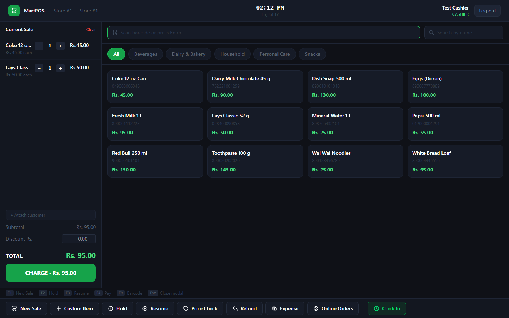
</p>

## 🚀 Live Demo

**https://d2qttg93iautmd.cloudfront.net**

| Role | How to log in | Credentials |
|---|---|---|
| Store Admin (back office) | **Email Login** tab | `demo.admin@mart.com` / `Demo@1234` |
| Cashier (POS terminal) | **PIN Login** tab → select *Demo Store* | PIN **`5678`** |

> The demo runs on a small EC2 instance — if it's temporarily offline, it has been paused to save cost.

---

## What it is

This is not a single app — it's a small **retail ecosystem** built the way real POS platforms
are structured (think Square or Shopify POS): separate deployable frontends sharing one
backend API, with multi-store isolation designed in from day one.

| System | Users | Stack |
|---|---|---|
| **POS terminal** | Cashiers at the counter | React 19 PWA — offline-capable, barcode-scanner input, PIN login, large touch targets |
| **Back office** | Owners, admins, managers | React 19 — dashboards, reporting, full management suite |
| **Ecommerce storefront** | Online customers | Next.js 15 — catalog, cart, checkout; orders flow into the same inventory |
| **Shared API** | All of the above | Java 21 · Spring Boot 3.3 modular monolith · MySQL 8 · Flyway (24 migrations) · JWT auth |

## ✨ Feature Highlights

**Point of Sale**
- Barcode scan, search, or tap-to-add product grid with category filters
- Cart management: quantities, per-item and order discounts, hold & resume sales
- Cash / card / mobile payments, split payments, change calculation
- Discounts above a threshold require **manager PIN approval** at the terminal
- Void (before payment) and refund workflows with manager approval
- Customer attach + loyalty points earn/redeem at checkout
- Shift open/close with opening float, clock in/out, X/Z reports
- Works offline (PWA service worker) — catalog cached, writes require connectivity

**Back Office**
- Real-time dashboard: today's revenue, transactions, low-stock alerts, active cashiers
- Product & category management with multi-unit support (carton → pack → unit) and variants
- Inventory: stock receiving, adjustments with reasons, movement audit trail, low-stock email alerts
- Purchase orders with supplier management — including "generate PO from low stock" in one click
- Reports: P&L with gross margin, payment-type breakdown, peak hours, top products,
  category performance, daily trend, cashier performance — CSV export and print/PDF
- Z-Report and cash reconciliation (expected vs counted drawer)
- Promotions engine (order / product / category level), expenses tracking, attendance
- Online order intake from the ecommerce storefront (confirm → fulfill workflow)
- User management with 4 role levels, immutable audit log of every critical action

**AI Assistant** (admin + cashier)
- Role-scoped chat that answers **only from your own store's data** — sales, margins,
  inventory, product lookups — grounded in a live store-scoped snapshot (no hallucinated numbers)
- Admin panel for analytical questions; a fast one-line cashier lookup on the POS
- All LLM calls routed through a **Secure LLM API Gateway** (API-key auth, rate limiting,
  prompt-injection scanning, token/audit logging); no provider SDK in this codebase

**Architecture & Security**
- Modular monolith: 20+ cleanly separated domain modules ready to split if ever needed
- JWT access/refresh token rotation; PIN-based auth for cashier terminals
- Every endpoint role-gated with `@PreAuthorize`; every entity store-scoped
- Completed sales are immutable — corrections only via void/refund, all audit-logged
- Database schema owned entirely by Flyway migrations (`ddl-auto: validate`)

---

## 📸 Screenshots

### Cashier POS

| Login (PIN pad) | POS terminal with active sale |
|---|---|
| 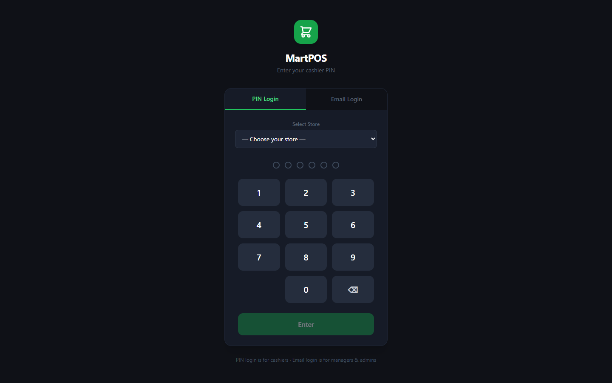 |  |

### Back Office

| Dashboard | Reports & P&L |
|---|---|
| 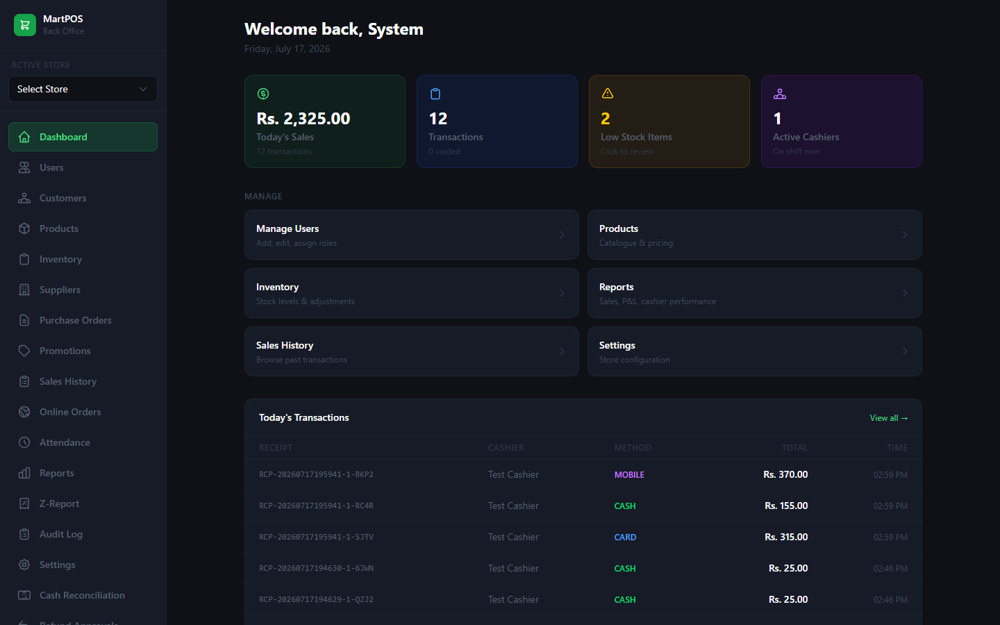 | 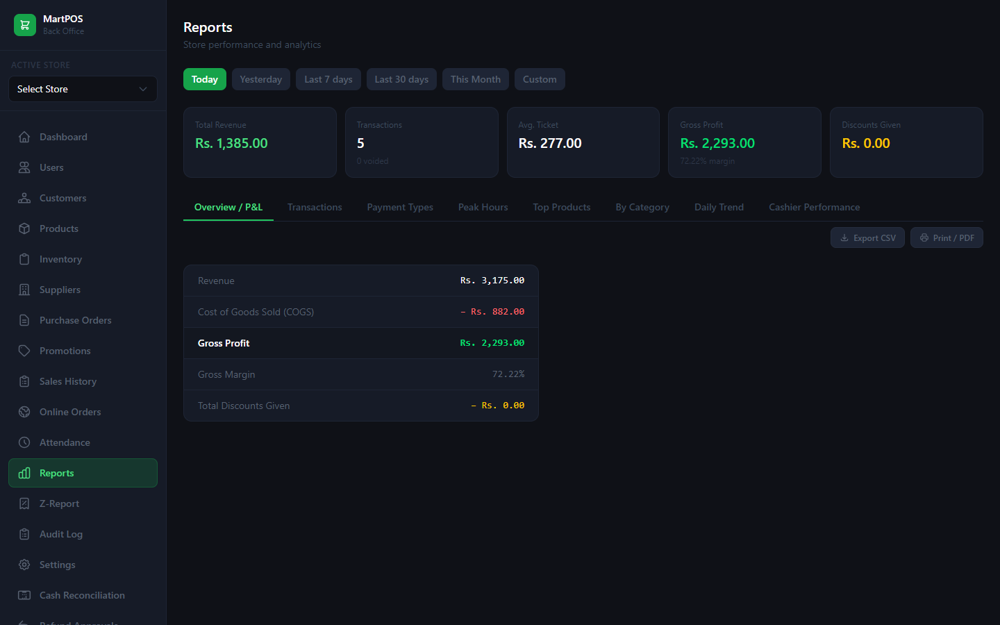 |

| Products | Inventory |
|---|---|
| 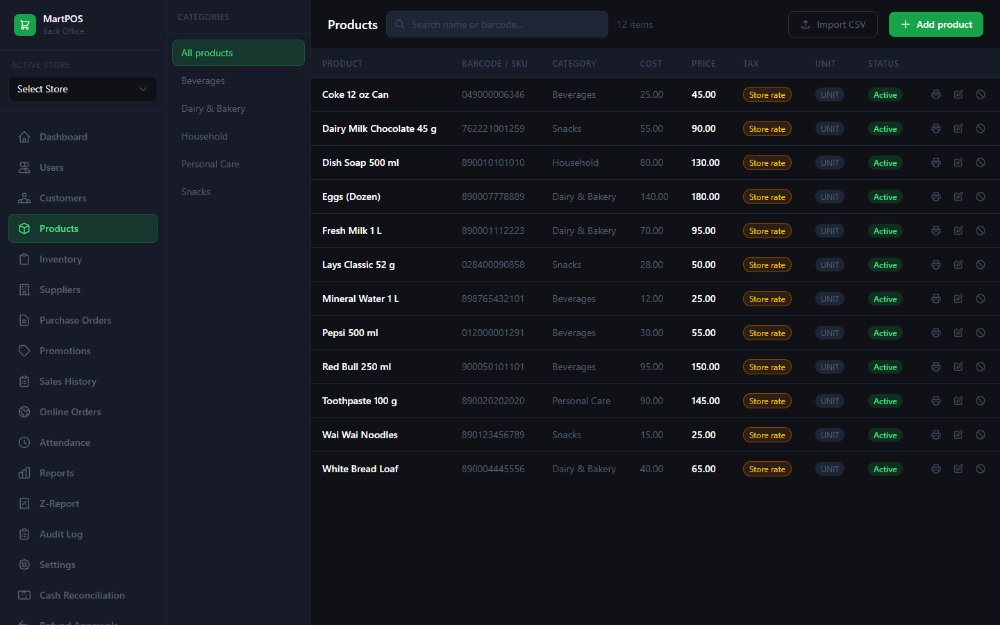 | 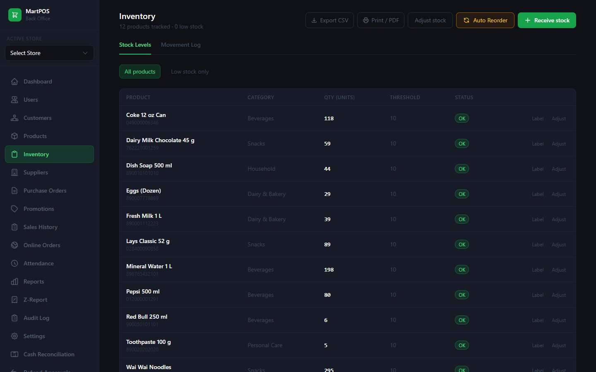 |

<details>
<summary><b>More screenshots</b> — sales history, Z-report, customers, purchase orders, promotions, users, cash reconciliation, audit log</summary>

| Sales History | Z-Report |
|---|---|
| 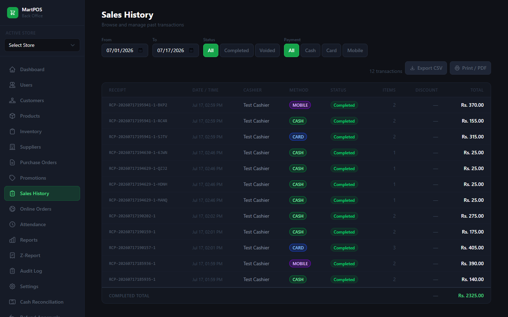 | 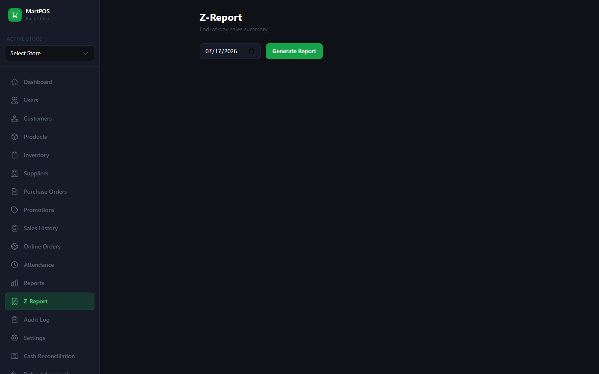 |

| Customers & Loyalty | Purchase Orders |
|---|---|
| 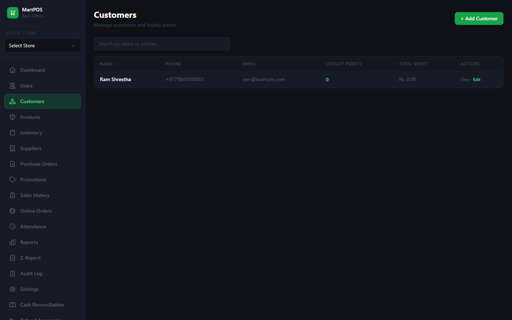 | 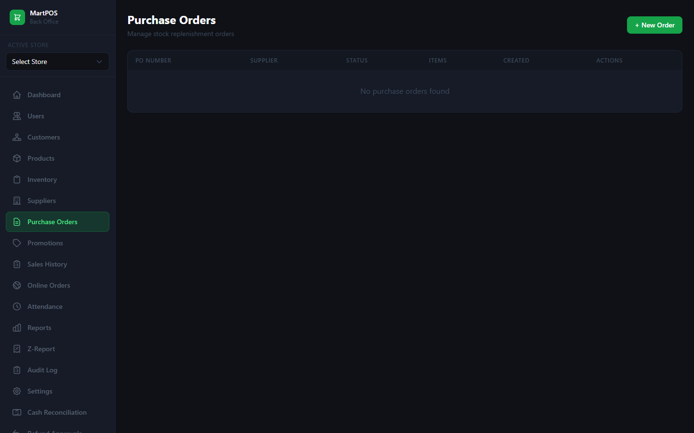 |

| Promotions | User Management |
|---|---|
| 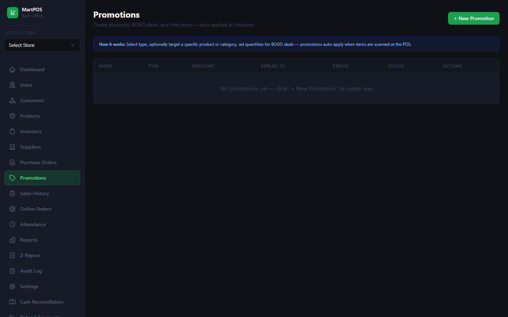 | 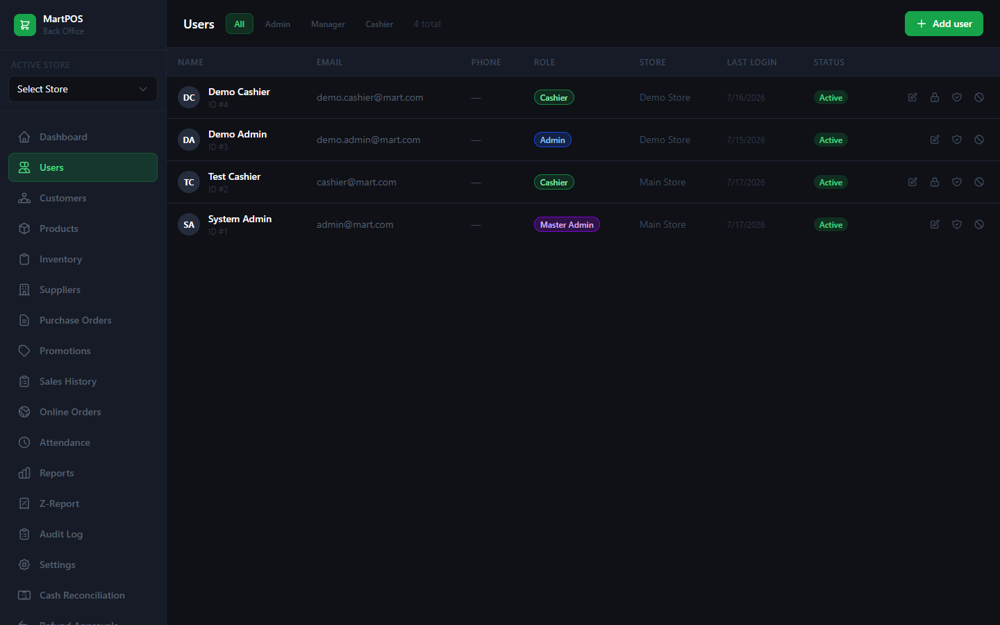 |

| Cash Reconciliation | Audit Log |
|---|---|
| 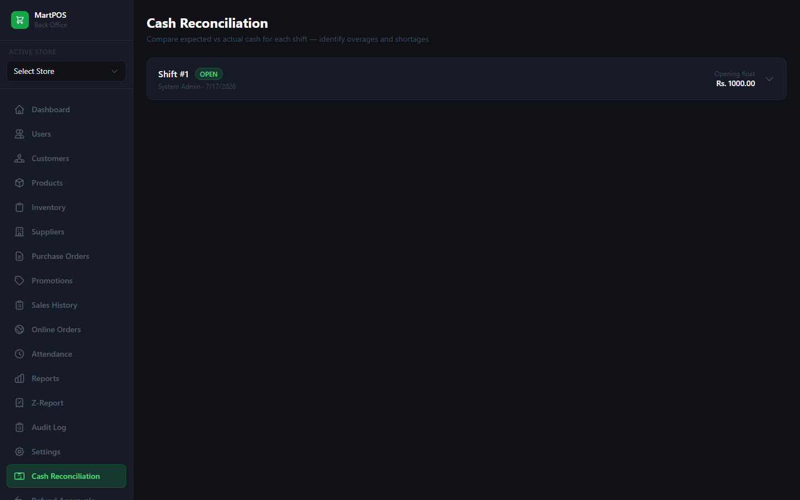 | 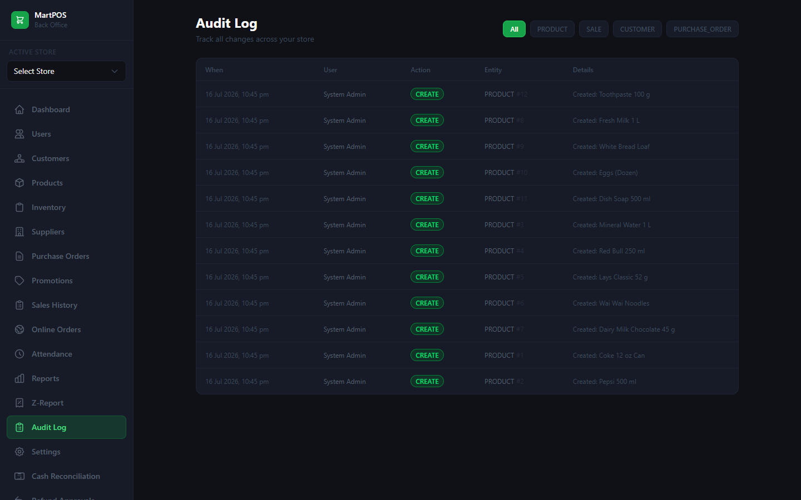 |

</details>

---

## 🏗 Architecture

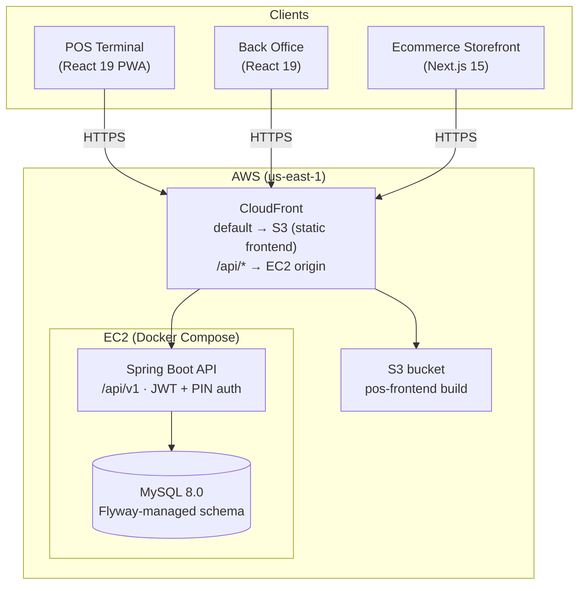

- **One CloudFront distribution** serves everything: static frontend from a private S3 bucket
  (Origin Access Control), and `/api/*` proxied to the backend — same-origin, so no CORS in
  production and free TLS.
- **EC2 port 8080 only accepts CloudFront's IP range** (AWS managed prefix list); SSH is
  restricted to an allowlisted IP. MySQL is never exposed.
- Server can be **stopped/started on demand** to control cost (`aws/aws-up.ps1`,
  `aws-down.ps1`) — Docker restarts the stack automatically and the URL never changes.

### Backend modules

```
com.mart
├── common          # ApiResponse<T>, exceptions, JWT security, JPA auditing
└── module
    ├── auth        # email + PIN login, refresh token rotation
    ├── user        # users, roles, PIN management
    ├── store       # multi-store support
    ├── product     # products, barcodes, multi-unit, variants
    ├── category    # product categories
    ├── inventory   # stock balances, receiving, adjustments, low-stock alerts
    ├── sale        # cart → sale, receipts, voids
    ├── payment     # cash / card / mobile, split payments
    ├── refund      # refund workflow with manager approval
    ├── shift       # store shifts, cash reconciliation, Z-report
    ├── attendance  # clock in/out
    ├── customer    # customers + loyalty points
    ├── promotion   # order/product/category promotions
    ├── supplier    # suppliers
    ├── purchaseorder # POs, receiving, from-low-stock generation
    ├── expense     # expense tracking
    ├── report      # sales, P&L, cashier performance, trends
    ├── audit       # immutable audit log
    └── ecommerce   # storefront catalog, cart, orders, customer auth
```

## 👥 Roles

| Role | Access |
|---|---|
| `MASTER_ADMIN` | Everything, across all stores |
| `ADMIN` | Full access to their store |
| `MANAGER` | Inventory, reports, refund approvals, cashier management |
| `CASHIER` | POS only — PIN login at the terminal |

---

## 📖 Usage Guide

### As a cashier (POS)

1. **Log in** — open the app, keep the **PIN Login** tab, choose your store, enter your PIN
   (demo: *Demo Store*, PIN `5678`).
2. **Clock in / open shift** — use *Clock In* (bottom bar). Sales require an open store shift
   (opened by a manager from the back office or POS).
3. **Ring up a sale** — scan a barcode into the always-focused scan box, search by name, or
   tap product tiles. Adjust quantities with +/− in the cart.
4. **Discounts** — enter a rupee discount in the cart panel. Discounts above the store
   threshold prompt for a **manager PIN**.
5. **Take payment** — hit **CHARGE** (or `F4`), pick cash/card/mobile or split, enter amount
   tendered; change due is calculated. Receipt can be printed or emailed.
6. **Hold / Resume** — park a sale mid-transaction (`F2`) and recall it later (`F3`).
7. **Refunds & voids** — *Refund* starts a refund against an original receipt (needs manager
   approval); voiding is only possible before payment completes.
8. **Price check / custom item / expenses / online orders** — all available from the bottom
   action bar. Keyboard shortcuts are shown on-screen (`F1` new sale, `F9` barcode, `Esc` close).

### As an admin or manager (back office)

1. **Log in** — **Email Login** tab (demo: `demo.admin@mart.com` / `Demo@1234`). You land on
   the **Dashboard**: today's sales, transaction count, low-stock alerts, active cashiers.
2. **Set up the catalog** — *Products* → add products with barcode, cost/selling price,
   category, tax and low-stock threshold. Bulk CSV import is supported.
3. **Stock the shelves** — *Inventory* → receive stock (converted automatically between
   carton/pack/unit), make adjustments with reasons, and review the movement log.
4. **Open the day** — open the store shift with an opening float so cashiers can sell.
5. **Watch the business** — *Reports* → P&L, payment types, peak hours, top products, daily
   trend, cashier performance; filter by day/week/month/custom; export CSV or print.
6. **Close the day** — *Z-Report* for the end-of-day summary and *Cash Reconciliation* to
   compare expected vs counted drawer cash.
7. **Manage the team** — *Users* → create cashiers (assign PINs), managers, and admins.
   *Attendance* shows clock in/out records.
8. **Restock** — *Suppliers* and *Purchase Orders*; the *from low stock* button drafts a PO
   for everything under its threshold. Receive the PO to update inventory.
9. **Promotions & loyalty** — create date-bound promotions (order, product, or category
   scope); customer loyalty accrues automatically and is redeemable at the POS.
10. **Audit** — every discount, override, void, refund, and price change is in *Audit Log*.

---

## 🛠 Local Development

**Prerequisites:** Java 21, Node 20+, Docker

```bash
# 1. Database (MySQL 8 in Docker)
cd pos-backend
docker compose up -d

# 2. Backend API  →  http://localhost:8080/api/v1  (Swagger UI at /api/v1/swagger-ui)
./mvnw spring-boot:run

# 3. POS / back-office frontend  →  http://localhost:3001
cd ../pos-frontend
npm install
npm run dev

# 4. (Optional) ecommerce storefront  →  http://localhost:3002
cd ../ecommerce-frontend
npm install
npm run dev
```

Dev seed users (created by Flyway): admin `admin@mart.com` / `Admin@1234`, cashier PIN `1234`.

## ☁️ Production Deployment (AWS)

The repo ships with everything used for the live deployment:

| Piece | File |
|---|---|
| Backend + MySQL on one host | [`pos-backend/docker-compose.prod.yml`](pos-backend/docker-compose.prod.yml) |
| Backend container build | [`pos-backend/Dockerfile`](pos-backend/Dockerfile) |
| Frontend production config | [`pos-frontend/.env.production`](pos-frontend/.env.production) (`VITE_API_URL=/api/v1` — same-origin via CloudFront) |
| Start / stop / status scripts | [`aws/aws-up.ps1`](aws/aws-up.ps1) · [`aws/aws-down.ps1`](aws/aws-down.ps1) · [`aws/aws-status.ps1`](aws/aws-status.ps1) |

Deploy outline: build the jar (`docker build`), ship it to the instance, `docker compose up -d`;
build the frontend (`npm run build`) and `aws s3 sync` the `dist/` to the bucket, then invalidate
CloudFront. Secrets (DB passwords, JWT secret) live only in an `.env` file on the server.

## 🧰 Tech Stack

| Layer | Technology |
|---|---|
| Backend | Java 21, Spring Boot 3.3, Spring Security, Spring Data JPA |
| Database | MySQL 8.0, Flyway migrations, HikariCP |
| Auth | JWT (15 min access + 7 day refresh, rotation), BCrypt, PIN auth for terminals |
| POS / Back office | React 19, TypeScript, Vite, Tailwind CSS 4, Zustand, TanStack Query, React Hook Form + Zod, vite-plugin-pwa |
| Storefront | Next.js 15, React 19, Tailwind CSS |
| API docs | SpringDoc OpenAPI (Swagger UI, dev only) |
| Infra | AWS EC2 (Docker Compose), S3 + CloudFront (OAC, SPA rewrite via CloudFront Function), Elastic IP |

## 📄 License

Personal portfolio project — all rights reserved. Feel free to browse the code and reach out
if you'd like to use any part of it.
